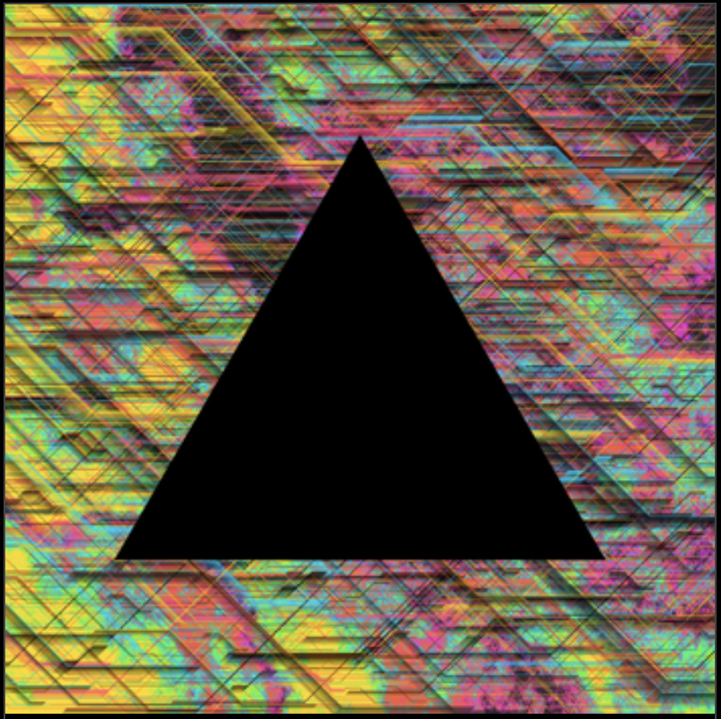

## Glitch Forge

Website: https://glitchforge.xyz/

### Description
In their own words, Glitch Forge is a hybrid generative NFT platform that creates art that uses programming tools and raw materials to forge new art when collectors mint it. The main mechanic, is an auction mechanic. Users place a starting bid to have a unique art piece generated during an auction. If they like their piece, they keep bidding. Only the highest bidders have their unique pieces minted. 

### My Work

At Glitch Forge, my focus was on developing their new On-Demand platform. The goal, to take the unique aspects of their current auction mechanic
and allow customers to buy pieces on the spot. Users are shown example images that are representative of the art they are buying. However, when
they buy a piece, a one of a kind work is generated from the code and images the artist provides. 

While most of the code I wrote is private, **ondemand_collections.py** is an example of some of the code I worked on. This is a contract that governs collections on the tezos blockchain. Among many other things, it has the functionality to create a collection, delete a collection, and update a collection.

