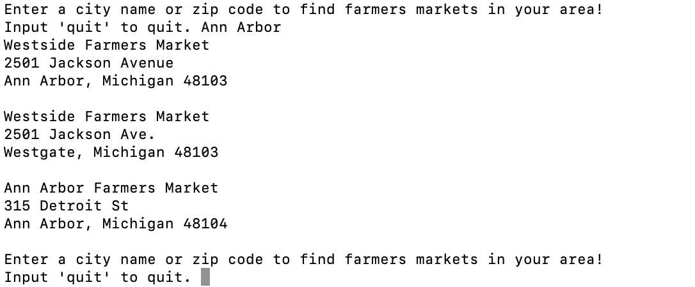

## Markets

This is a command line program to print out a list of farmers markets in an area based on user input of a zip code or city. Markets.txt is a database of
information on over 7,000 farmers markets. This program functions, read_market_data, to read the file information and populate
dictionaries based on user input. There is also a print_market_data function to return a human readable string of farmers market information. 

